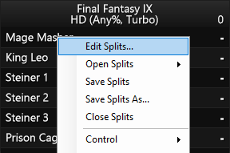
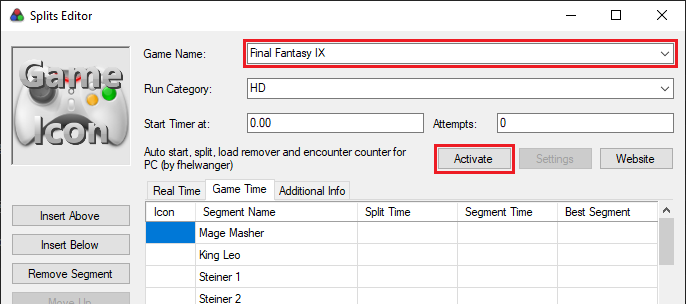
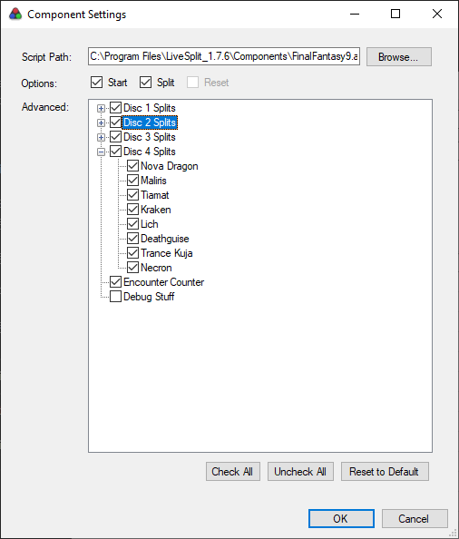
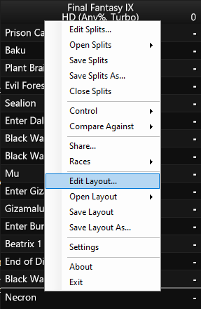
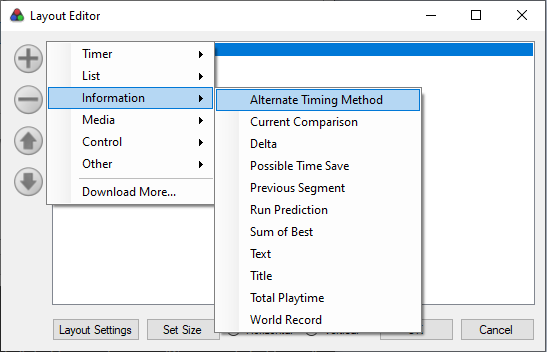
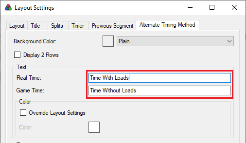
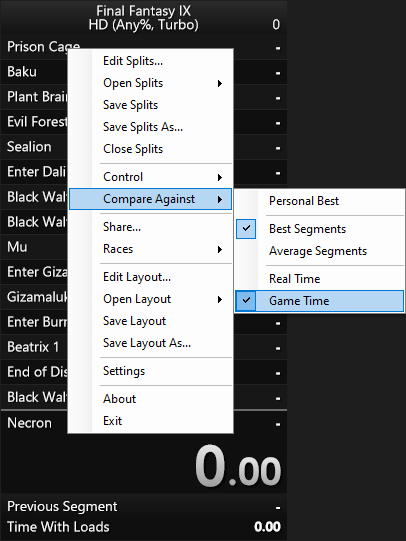
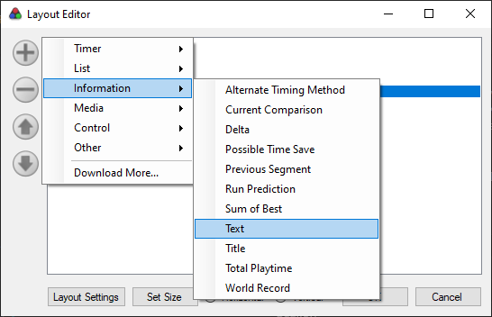
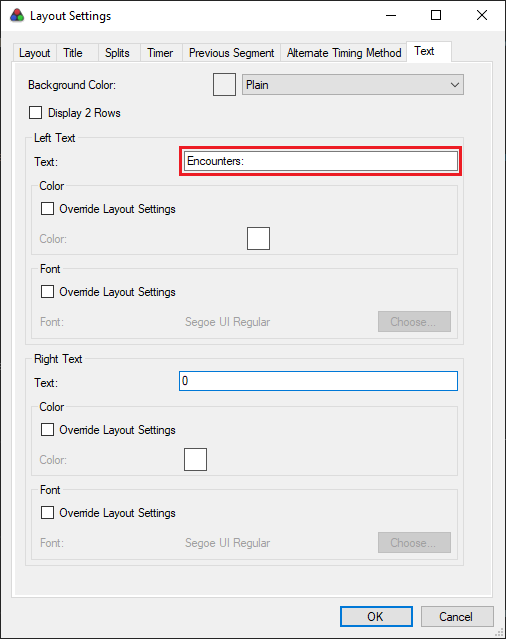

# Final Fantasy IX auto splitter for LiveSplit 🎮⏱

## Features

- Auto start
- Auto split
- Load remover
- Encounter counter

## Install

### 1. Edit Splits

Open LiveSplit and go to "Edit Splits". If you don't have splits for FF9, you can download them [here](https://raw.githubusercontent.com/fhelwanger/ff9-auto-splitter/master/BaseSplits.lss).

### 2. Activate the auto splitter

On the "Splits Editor", make sure that the game is set to exactly "Final Fantasy IX". After that, click "Activate".

### 3. Auto splitter settings

Press the "Settings" button next to the "Activate" button and a new "Component Settings" window should appear. Here you can select if you want to auto start the timer, auto split and which splits you want. Just make sure that if you uncheck some split, you also remove it from your splits on the previous window (for example, if you don't kill Tantarian in your route, you should remove the "Tantarian" split). The auto-splitter will split based on the order of the splits, so you can name them whatever you want (for example, you can rename "Steiner 3" to "Bomb" and it'll work).

By default, it also includes an encounter counter that will be explained bellow. If you don't want to use the encounter counter, you can just uncheck it here.

### 4. Configure the load remover

Download the "Alternate Timing Method" component from the [LiveSplit Components page](http://livesplit.org/components/). Extract the files into your LiveSplit Components folder (for example, "LiveSplit_1.7.6\Components").

Right click on your splits and click on "Edit Layout".

In the "Layout Editor", click on "+", "Information", "Alternate Timing Method".

If you wish, double click the "Alternate Timing Method" in the list to open its settings and change its text.

To change the current comparison to use Game Time (Time Without Loads) instead of Real Time (Time With Loads), right click on your splits and select to "Compare Against", "Game Time".

This way, the "Time Without Loads" will be used on your splits but you'll have an additional timer using the "Alternate Timing Method" component to show the "Time With Loads".

### 5. Configure the encounter counter

Make sure that "Encounter Counter" is checked as explained on step 3. After that, go to "Edit Layout" again and this time, add a new "Text" component.

Double click the Text component in the list to open its settings. Change the left text to be **exactly** "Encounters:".

